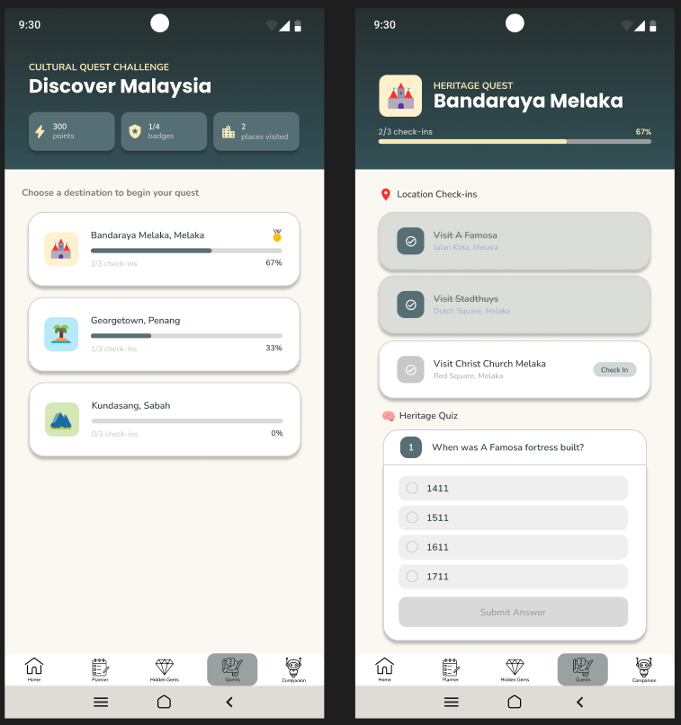

# PROJECT PROPOSAL: QuestMY
KULLIYYAH OF INFORMATION AND COMMUNICATION TECHNOLOGY  
INFO 4335 MOBILE APPLICATION DEVELOPMENT SECTION 2  
GROUP 3 SEMESTER 2, 2025/2026  

---

## GROUP MEMBERS

| NO. | NAME | MATRIC NO | TASK |
|------|------|------------|------|
| 1 | KAMA AZIRA BINTI MAT ASHRI | 2316826 | INTRO, ARCHITECTURE DESIG, PROTOTYPE (HOME DASHBOARD, SMART TRAVEL COMPANION) |
| 2 | IRDINA AMALIN HUSNA BINTI ISHAK | 2318724 | FEATURES & FUNCTIONALITY, PROTOTYPE (0NBOARDING, HIDDEN GEMS COMMUNITY) |
| 3 | PUTERI NUR IMAN ADRIENNA BINTI MUHAMMAD HAFIDZ | 2316278 | TARGET USERS, FLOWCHART, PROTOTYPE (LOGIN & REGISTER, CULTURE QUEST CHALLENGE) |
| 4 | PUTRI NUREEN BALQIS BINTI MOHD HAIZAM | 2314984 | OBJECTIVES, DATA MODEL, PROTOTYPE (SETTING & PROFILE, SMART JOURNEY PLANNER) |

  
## 1.0 INTRODUCTION

### 1.1 Background of Study  
The tourism industry has increasingly adopted digital technologies to improve travel experiences and information accessibility. However, most existing tourism applications remain fragmented, focusing individually on navigation, trip planning, or user reviews. This forces travelers to use multiple platforms to complete a single journey, reducing convenience and overall engagement, especially with cultural and lesser-known destinations.

### 1.2 Problem Statement  
In Malaysia, many hidden gems and community-based tourism attractions are underrepresented due to the lack of a centralized discovery platform. Existing tourism apps also lack gamification features and provide limited personalized, real-time recommendations which reduces user engagement and informed decision-making during travel.

### 1.3 Proposed Solution  
To address these issues, this project proposes QuestMY: Discover. Explore. Complete., an AI-powered community tourism platform that integrates trip planning, hidden gem discovery, cultural gamification, and real-time travel assistance in a single mobile application.

### 1.4 Motivation  
The development of QuestMY is driven by the need for a more interactive and personalized tourism experience. By combining multiple tourism functions into one platform, the application enhances travel convenience while encouraging cultural exploration and community participation.

### 1.5 Relevance of the Project  
This project supports Malaysia’s tourism development by promoting local attractions and cultural heritage. It also demonstrates the practical use of modern mobile technologies such as Flutter, Firebase, Google Maps API, and geolocation services.

---

## 2.0 Objectives
1. To analyze users' travel prefereneces, interests, and behaviour using Ai techniques to generate personalized travel recommendations and itineraries.
2. To develop a community-generated reviews, ratings, and travel experiences in order to recommend relevant hidden gems and attractions to users.
3. To provide real-time assistance, including navigation, local insights, weather updates and travel tips, to improve overall experience
4. To support sustainable tourism by encouraging visitors to explore diverse destinations beyond popular tourist hotspots.

## 3.0 Target Users
  The primary users of QuestMy are local and international travelers who enjoy exploring new places and experiencing different cultures. These users frequently use mobile applications to plan, manage their trips, and are interested in discovering unique attractions, receiving personalized travel recommendations, and accessing real-time travel assistance during their journeys. In addition, they enjoy interactive experiences such as challenges, rewards, and gamified activities that make travelling more engaging and enjoyable. QuestMy helps these users by providing trip planning tools, community-based recommendations, cultural activities, and travel support in a single platform. 
  The secondary users of QuestMy are local community members who want to share their knowledge and experiences with travelers. These users may include local residents, tourism enthusiasts, and individuals who are familiar with hidden attractions, local events, and cultural activities in their area. They contribute valuable information to the platform by sharing recommendations, travel tips, and insights about local culture. Through QuestMy, they can help tourists discover authentic experiences while promoting local attractions and strengthening community involvement in tourism. 

## 4.0 Features & Functionalities

QuestMY consists of four main modules that provide trip planning, attraction discovery, cultural engagement, and AI-powered travel assistance within a single platform. The application integrates Flutter, Firebase, Google Maps API, Geolocator, and Gemini AI to deliver a seamless and personalized tourism experience.

### 4.1 User Authentication & Profile Management

This module enables users to securely access the application and manage their personal information.

#### Features
- User registration using email and password
- User login and logout
- Profile management
- Secure authentication using Firebase Authentication

#### User Interaction
Users create an account, log in to the application, and access personalized travel information such as saved trips, reviews, achievements, and travel preferences.

---

### 4.2 Smart Journey Planner

This module helps users organize and manage their travel itineraries efficiently.

#### Features
- Create and manage travel plans
- Add destinations and attractions
- Travel calendar scheduling
- Budget planning and expense tracking
- Save favourite locations
- View planned trips and travel history

#### User Interaction
Users create a trip, add destinations of interest, organize travel schedules, monitor estimated expenses, and save itineraries for future reference.

---

### 4.3 Hidden Gems & Community Discovery

This module enables users to discover unique attractions and share travel experiences with the community.

#### Features
- Hidden gem attraction submissions
- Attraction reviews and ratings
- Image upload and sharing
- Community recommendations
- Search and filtering by category or location
- Save attractions to favourites

#### User Interaction
Users can upload photos of attractions, write reviews, provide ratings, and browse recommendations contributed by other community members. Hidden gems discovered through the community can be added directly to users’ travel plans.

---

### 4.4 Cultural Quest & Tourism Gamification

This module encourages users to engage with local culture and heritage through interactive tourism challenges.

#### Features
- Tourism missions and challenges
- Location-based check-in system
- Heritage and cultural quizzes
- Achievement badges and rewards
- State completion tracker

#### Example Challenge

**Melaka Heritage Quest**
- Visit A Famosa
- Visit Stadthuys
- Complete Heritage Quiz

**Reward:** 🏅 Melaka Explorer Badge

#### User Interaction
Users visit designated attractions, complete location check-ins, answer cultural quizzes, and earn achievement badges that are stored in their digital travel passport. The system tracks user progress and encourages exploration of cultural and historical destinations throughout Malaysia.

---

### 4.5 Smart Travel Companion

This module provides real-time travel assistance and AI-powered recommendations based on the user's current location, travel preferences, and interests.

#### Features
- Nearby attraction recommendations
- Nearby halal food recommendations
- Nearby events and festivals
- Travel alerts and updates
- Personalized travel suggestions
- AI travel assistant powered by Gemini AI

#### AI-Powered Recommendation System

Gemini AI analyses:
- User interests and travel preferences
- Saved destinations and favourite attractions
- Current location
- Community reviews and ratings
- Ongoing events and nearby attractions

Based on these inputs, the AI generates personalized recommendations and contextual travel guidance to enhance the user's travel experience.

#### Example Recommendation

**Current Location:** Jonker Street, Melaka

**User Interests:** Heritage, Local Food, Photography

**Gemini AI Suggestions:**
- Visit Melaka Sultanate Palace Museum
- Explore Kampung Morten Cultural Village
- Try local Nyonya cuisine nearby
- Attend a cultural performance tonight

#### User Interaction
Users open the Smart Travel Companion module, allow location access, and receive AI-generated recommendations tailored to their travel preferences and current surroundings.

---

### 4.6 Firebase Integration

Firebase services are integrated throughout the application to support authentication, cloud storage, notifications, and real-time data management.

| Firebase Service | Purpose |
|------------------|----------|
| Firebase Authentication | User registration and login |
| Cloud Firestore | Store trips, reviews, achievements, user profiles, and attraction data |
| Firebase Storage | Store uploaded attraction images |
| Firebase Cloud Messaging | Send travel alerts and notifications |

---

### 4.7 External Packages & APIs

The application utilizes several external packages and APIs to improve functionality and user experience.

| Technology | Purpose |
|------------|----------|
| Flutter | Mobile application development |
| Firebase | Backend services and cloud database |
| Google Maps API | Location and map services |
| Geolocator | User location detection |
| Provider | State management |
| Gemini AI API | Personalized travel recommendations and AI assistance |

These technologies enable location-based services, AI-powered recommendations, real-time data synchronization, map integration, and efficient application state management.

### 4.8 Module Assignment

The development of QuestMY is divided into four main modules, with each group member responsible for designing, implementing, and presenting a specific feature of the application.

| Member | Module | Responsibilities |
|----------|----------|----------|
| **Putri Nureen Balqis Binti Mohd Haizam** | Smart Journey Planner | Develop trip planning features including itinerary creation, destination management, budget planning, travel calendar, and favourite locations. |
| **Irdina Amalin Husna Binti Ishak** | Hidden Gems & Community Discovery | Develop community-based attraction sharing features including reviews, ratings, image uploads, recommendations, and search functionality. |
| **Puteri Nur Iman Adrienna Binti Muhammad Hafidz** | Cultural Quest & Tourism Gamification | Develop tourism challenges, location check-ins, cultural quizzes, achievement badges, and progress tracking. |
| **Kama Azira Binti Mat Ashri** | Smart Travel Companion | Develop real-time travel assistance features including nearby recommendations, location services, travel alerts, and Gemini AI-powered recommendation system. |

Each module is integrated through Firebase services and follows a shared application architecture to ensure seamless user experience and data synchronization throughout the platform.

## 5.0 UI Mock-up

## 5.1 Onboarding Screens

The onboarding screens introduce users to QuestMY and provide a brief overview of the application's key features.

---
## 5.2 Home Dashboard

This module serves as the user’s main overview page, providing quick access to travel progress, upcoming trips, and recommendations.

**Features:**
- View travel overview and activity summary
- Track planned trips and completed destinations
- Access upcoming adventures and itineraries
- Continue ongoing quests and progress
- Explore recommended destinations
- Quick navigation to main modules

---
## 5.3 Smart Journey Planner

This module enable users to plan their trip, itenerary and budget.

### Travel Planner Page

### Add a new trip page

### Itenerary and Budget Page

**Features :**
- Trip creation
- Destination management
- Itenerary creation
- Budget planning

## 5.4 Hidden Gems & Community Discovery

This module enables users to discover, share, and review unique attractions across Malaysia through community contributions.

### Hidden Gems Home Screen

**Features:**
- Search attractions
- Category filtering
- View ratings and attraction information
- Add new hidden gems

---

### Hidden Gem Details Screen

**Features:**
- Attraction details
- Location information
- Ratings and reviews
- Add review functionality

---

### Add Hidden Gem Screen

**Features:**
- Attraction name and description
- Location input
- Category selection
- Image upload
- Submit attraction

---

### Add Review Screen

**Features:**
- Star rating system
- Review submission
- Community feedback contribution

---

## 5.5 Cultural Quest & Tourism Gamification
This module encourages users to engage with local culture and heritage through interactive tourism challenges.

**Features:**
- Tourism missions and challenges
- Location-based check-in system
- Heritage and cultural quizzes
- Achievement badges and rewards
- State completion tracker
  
---

## 5.6 Smart Travel Companion
This module provides real-time assistance based on the user’s current location, helping them explore nearby attractions, food spots, and events more efficiently.

**Features:**
- Display current location and weather information
- AI-powered travel suggestions based on nearby attractions
- Discover nearby attractions with ratings and distance
- Find nearby restaurants and local food spots
- Explore nearby events and activities
- Receive travel alerts and route updates
- Save suggestions for later reference
  
---

## 6.0 Architectural / Technical Design
### 6.1 System Architecture
QuestMY uses a client–server architecture, where the Flutter mobile app acts as the frontend and Firebase serves as the backend. The system supports real-time data sync for travel planning, community updates, and user progress.

### 6.2 Widget / Component Structure
The app is built using a feature-based modular structure to improve organization and scalability. Each module contains its own screens, widgets, and services.

### Main Modules:
1. Authentication: Login, Register, Auth wrapper
2. Smart Journey Planner: Trip creation, itinerary, budget tracker
3. Hidden Gems Community: Discover places, upload, reviews
4. Cultural Quest: Missions, check-in, badges, progress
5. Smart Travel Companion: Nearby places, map, recommendations

### Shared Widgets:
1. Buttons
2. App bars
3. Loading indicators
4. Navigation bar

### 6.3 State Management
The app uses Provider for state management because it is simple, lightweight and suitable for Flutter-Firebase integration.

### Main Providers:
1. AuthProvider: User login and session
2. TripProvider: Trip and itinerary data
3. PlaceProvider: Hidden gems and search
4. QuestProvider: Missions, badges, progress
5. LocationProvider: Real-time location and nearby suggestions

### 6.4 System Architecture Diagram

## 7.0 Data Model

## 8.0 Flowchart

## 9.0 References

Dribbble. (n.d.). *Web design*.  
&nbsp;&nbsp;&nbsp;&nbsp;https://dribbble.com/tags/web-design  

GeeksforGeeks. (2025, December 27). *Client-server architecture – System design*.  
&nbsp;&nbsp;&nbsp;&nbsp;https://www.geeksforgeeks.org/system-design/client-server-architecture-system-design/  

Google. (n.d.). *Google Maps Platform*.  
&nbsp;&nbsp;&nbsp;&nbsp;https://mapsplatform.google.com/  

Google. (n.d.). *Firebase*.  
&nbsp;&nbsp;&nbsp;&nbsp;https://firebase.google.com/  

Google DeepMind. (n.d.). *Gemini*.  
&nbsp;&nbsp;&nbsp;&nbsp;https://deepmind.google/technologies/gemini/  

Flutter. (n.d.). *Flutter*.  
&nbsp;&nbsp;&nbsp;&nbsp;https://flutter.dev/  

Tourism Malaysia. (n.d.). *Malaysia Travel Official Website*.  
&nbsp;&nbsp;&nbsp;&nbsp;https://www.malaysia.travel/  

Wanderlog. (n.d.). *Wanderlog: Trip planner app and itinerary builder*.  
&nbsp;&nbsp;&nbsp;&nbsp;https://wanderlog.com/  

