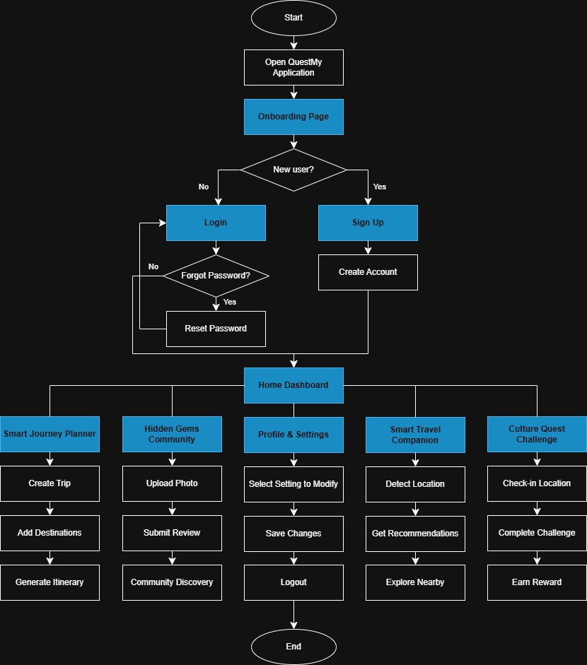

# QuestMy

## Group Information

**Group** : 3
**Section** : 2
**Group Members** :
- KAMA AZIRA BINTI MAT ASHRI (2316826)
- IRDINA AMALIN HUSNA BINTI ISHAK (2318724)
- PUTERI NUR IMAN ADRIENNA BINTI MUHAMMAD HAFIDZ (2316278)
- PUTRI NUREEN BALQIS BINTI MOHD HAIZAM (2314984)

## Introduction

## Objectives

## Target Users
  The primary users of QuestMy are local and international travelers who enjoy exploring new places and experiencing different cultures. These users frequently use mobile applications to plan, manage their trips, and are interested in discovering unique attractions, receiving personalized travel recommendations, and accessing real-time travel assistance during their journeys. In addition, they enjoy interactive experiences such as challenges, rewards, and gamified activities that make travelling more engaging and enjoyable. QuestMy helps these users by providing trip planning tools, community-based recommendations, cultural activities, and travel support in a single platform. 
  The secondary users of QuestMy are local community members who want to share their knowledge and experiences with travelers. These users may include local residents, tourism enthusiasts, and individuals who are familiar with hidden attractions, local events, and cultural activities in their area. They contribute valuable information to the platform by sharing recommendations, travel tips, and insights about local culture. Through QuestMy, they can help tourists discover authentic experiences while promoting local attractions and strengthening community involvement in tourism. 

## Features & Functionalities

## UI Mock-up

## Architectural / Technical Design

## Data Model

## Flowchart

## References
