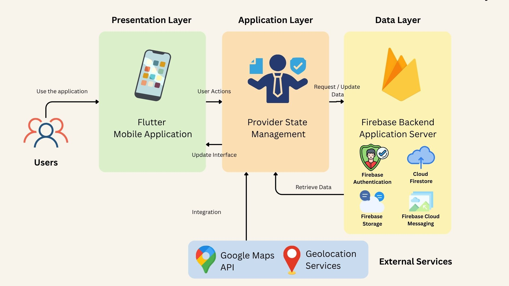

# PROJECT PROPOSAL: QuestMY
KULLIYYAH OF INFORMATION AND COMMUNICATION TECHNOLOGY  
INFO 4335 MOBILE APPLICATION DEVELOPMENT SECTION 2  
GROUP 3 SEMESTER 2, 2025/2026  

---

## GROUP MEMBERS

| NO. | NAME | MATRIC NO | TASK |
|------|------|------------|------|
| 1 | KAMA AZIRA BINTI MAT ASHRI | 2316826 |  |
| 2 | IRDINA AMALIN HUSNA BINTI ISHAK | 2318724 |  |
| 3 | PUTERI NUR IMAN ADRIENNA BINTI MUHAMMAD HAFIDZ | 2316278 |  |
| 4 | PUTRI NUREEN BALQIS BINTI MOHD HAIZAM | 2314984 |  |

  
## 1.0 INTRODUCTION

### 1.1 Background of Study  
The tourism industry has increasingly adopted digital technologies to improve travel experiences and information accessibility. However, most existing tourism applications remain fragmented, focusing individually on navigation, trip planning, or user reviews. This forces travelers to use multiple platforms to complete a single journey, reducing convenience and overall engagement, especially with cultural and lesser-known destinations.

### 1.2 Problem Statement  
In Malaysia, many hidden gems and community-based tourism attractions are underrepresented due to the lack of a centralized discovery platform. Existing tourism apps also lack gamification features and provide limited personalized, real-time recommendations which reduces user engagement and informed decision-making during travel.

### 1.3 Proposed Solution  
To address these issues, this project proposes QuestMY: Discover. Explore. Complete., an AI-powered community tourism platform that integrates trip planning, hidden gem discovery, cultural gamification, and real-time travel assistance in a single mobile application.

### 1.4 Motivation  
The development of QuestMY is driven by the need for a more interactive and personalized tourism experience. By combining multiple tourism functions into one platform, the application enhances travel convenience while encouraging cultural exploration and community participation.

### 1.5 Relevance of the Project  
This project supports Malaysia’s tourism development by promoting local attractions and cultural heritage. It also demonstrates the practical use of modern mobile technologies such as Flutter, Firebase, Google Maps API, and geolocation services.

---

## 2.0 Objectives
1. To analyze users' travel prefereneces, interests, and behaviour using Ai techniques to generate personalized travel recommendations and itineraries.
2. To develop a community-generated reviews, ratings, and travel experiences in order to recommend relevant hidden gems and attractions to users.
3. To provide real-time assistance, including navigation, local insights, weather updates and travel tips, to improve overall experience
4. To support sustainable tourism by encouraging visitors to explore diverse destinations beyond popular tourist hotspots.

## 3.0 Target Users
  The primary users of QuestMy are local and international travelers who enjoy exploring new places and experiencing different cultures. These users frequently use mobile applications to plan, manage their trips, and are interested in discovering unique attractions, receiving personalized travel recommendations, and accessing real-time travel assistance during their journeys. In addition, they enjoy interactive experiences such as challenges, rewards, and gamified activities that make travelling more engaging and enjoyable. QuestMy helps these users by providing trip planning tools, community-based recommendations, cultural activities, and travel support in a single platform. 
  The secondary users of QuestMy are local community members who want to share their knowledge and experiences with travelers. These users may include local residents, tourism enthusiasts, and individuals who are familiar with hidden attractions, local events, and cultural activities in their area. They contribute valuable information to the platform by sharing recommendations, travel tips, and insights about local culture. Through QuestMy, they can help tourists discover authentic experiences while promoting local attractions and strengthening community involvement in tourism. 

## 4.0 Features & Functionalities

QuestMY consists of four main modules that provide trip planning, attraction discovery, cultural engagement, and real-time travel assistance within a single platform.

### 4.1 User Authentication & Profile Management

This module allows users to securely access the application and manage their personal information.

#### Features
- User registration using email and password
- User login and logout
- User profile management
- Secure authentication using Firebase Authentication

#### User Interaction
Users create an account, log in to the application, and access personalized travel information such as saved trips, reviews, achievements, and preferences.

---

### 4.2 Smart Journey Planner

This module helps users organize and manage their travel itineraries efficiently.

#### Features
- Create and manage travel plans
- Add destinations and attractions
- Travel calendar scheduling
- Budget planning and expense tracking
- Save favourite locations

#### User Interaction
Users create a trip, add destinations of interest, organize travel schedules, monitor estimated expenses, and save itineraries for future reference.

---

### 4.3 Hidden Gems & Community Discovery

This module enables users to discover unique attractions and share travel experiences with the community.

#### Features
- Hidden gem attraction submissions
- Attraction reviews and ratings
- Image upload and sharing
- Community recommendations
- Search and filtering by category or location

#### User Interaction
Users can upload photos of attractions, write reviews, provide ratings, and browse recommendations contributed by other community members.

---

### 4.4 Cultural Quest & Tourism Gamification

This module encourages users to engage with local culture and heritage through interactive tourism challenges.

#### Features
- Tourism missions and challenges
- Location-based check-in system
- Heritage and cultural quizzes
- Achievement badges and rewards
- Digital travel passport
- State completion tracker

#### Example Challenge

**Melaka Heritage Quest**
- Visit A Famosa
- Visit Stadthuys
- Complete Heritage Quiz

**Reward:** 🏅 Melaka Explorer Badge

#### User Interaction
Users visit designated attractions, complete location check-ins, answer cultural quizzes, and earn achievement badges that are stored in their digital travel passport.

---

### 4.5 Smart Travel Companion

This module provides real-time travel assistance and personalized recommendations based on the user's current location.

#### Features
- Nearby attraction recommendations
- Nearby halal food recommendations
- Nearby events and festivals
- Travel alerts and updates
- Personalized travel suggestions

#### Example Recommendation

**Current Location:** Jonker Street, Melaka

**Suggested Activities:**
- Hidden café nearby
- Cultural performance tonight
- Nearby halal food options
- Tourist crowd level updates

#### User Interaction
The application detects the user's location and provides recommendations for nearby attractions, food outlets, and ongoing cultural events to enhance the travel experience.

---

### 4.6 Firebase Integration

Firebase services are integrated throughout the application to support authentication, cloud storage, and real-time data management.

| Firebase Service | Purpose |
|------------------|----------|
| Firebase Authentication | User registration and login |
| Cloud Firestore | Store trips, reviews, achievements, and attraction data |
| Firebase Storage | Store uploaded images |
| Firebase Cloud Messaging | Send travel notifications and alerts |

---

### 4.7 External Packages & APIs

The application utilizes several external packages and APIs to improve functionality and user experience.

| Technology | Purpose |
|------------|----------|
| Flutter | Mobile application development |
| Firebase | Backend services |
| Google Maps API | Location and map services |
| Geolocator | User location detection |
| Provider | State management |

These technologies enable location-based services, real-time data synchronization, map integration, and efficient application state management.

### 4.1 User Authentication & Profile Management

## 5.0 UI Mock-up

## 6.0 Architectural / Technical Design
### 6.1 System Architecture
QuestMY uses a client–server architecture, where the Flutter mobile app acts as the frontend and Firebase serves as the backend. The system supports real-time data sync for travel planning, community updates, and user progress.

### 6.2 Widget / Component Structure
The app is built using a feature-based modular structure to improve organization and scalability. Each module contains its own screens, widgets, and services.

### Main Modules:
1. Authentication: Login, Register, Auth wrapper
2. Smart Journey Planner: Trip creation, itinerary, budget tracker
3. Hidden Gems Community: Discover places, upload, reviews
4. Cultural Quest: Missions, check-in, badges, progress
5. Smart Travel Companion: Nearby places, map, recommendations

### Shared Widgets:
1. Buttons
2. App bars
3. Loading indicators
4. Navigation bar

### 6.3 State Management
The app uses Provider for state management because it is simple, lightweight and suitable for Flutter-Firebase integration.

### Main Providers:
1. AuthProvider: User login and session
2. TripProvider: Trip and itinerary data
3. PlaceProvider: Hidden gems and search
4. QuestProvider: Missions, badges, progress
5. LocationProvider: Real-time location and nearby suggestions

### 6.4 System Architecture Diagram

## 7.0 Data Model

## 8.0 Flowchart

## 9.0 References

